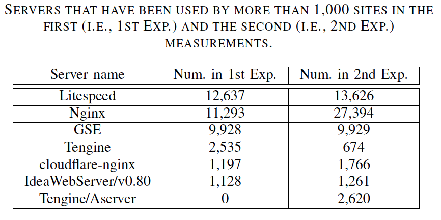

## Paper Review: Are HTTP/2 Servers Ready Yet? 
## (https://www4.comp.polyu.edu.hk/~csxluo/H2Scope.pdf)
This paper serves as a complementary reading for my final project in this course.
## Problems
HTTP/2 was standardized in 2015 with an expectation to make web applications faster and safer. HTTP/2 changes how messages are formatted, transmitted and processed. In addition, HTTP/2 adds many more advanced features to current HTTP protocol such as but not limited to Multiplexing, Flow Control, Stream Priority, Server Push, Header Compression, Ping. However, not every web application upgrade their implementation to make use of those features due to rework costs, unstable protocol or no benefits to do so. The paper is the first study to systematically investigate how the features are being adopted in top 1 million Alexa websites and in popular web server such as nginx, H2O, etc. The paper is important at the time publication because it updates the current adoption progress of websites to see if HTTP/2 is receiving good feedback and whether websites are implementing HTTP/2 correctly.
## Research Goals
- Examine the current adoption rate of HTTP/2 on top 1 million Alexa websites until January 2017.
- Assess how new features were implemented in top 6 most popular HTTP/2 servers (Nginx, Apache, H2O, Lightspeed, nghttpd and Tengine)
## Major Contributions
Major contributions of the authors are as follows:
- They were the first to investigate HTTP/2 features’ implementation in HTTP/2 servers
- They designed assessment methods to characterize those new features, implemented a new open-sourced tool H2Scope for experiments (https://github.com/valour01/H2Scope).
- They revealed insightful observations on the adoption rate of HTTP/2 on the top 1 million Alexa web sites.
## Basic HTTP/2 Concepts
- HTTP/2 reuses HTTP methods, status codes, header fields, etc. In HTTP/2, how HTTP messages are formatted, transmitted and processed was changed.
- Instead of plain text message in HTTP/1.1, HTTP/2 uses binary framing with 9-byte header.
- A new term “Stream” was introduced. Stream is a virtual channel which carries HTTP messages. According to the specification, one TCP connection serves all streams in a communication between client and server.
- Multiplexing is a new feature which is proposed to handle multiple streams on the same TCP connection. Therefore, streams are independent of each other and expected to reduce responding time. The related flag is SETTINGS_MAX_CONCURRENT_STREAMS which indicates the maximum number of concurrent streams supported by the sender.
- Flow Control is another feature which use a window concept to limit how much data a receiver can receive. This setting can happen at stream-level or the whole connection level.
- Stream Priority is a complicated feature which allows clients to declare important streams that they want servers to allocate more resources for them by defining a stream dependency graph.
- Server Push is a feature which was designed to allow server to preemptively send resources to clients to reduce latency.
- For header compression, HTTP/2 uses a technique named HPACK to compress header fields using Huffman coding, and maintain a dynamic table on both client and server to cache previous header fields.
- Ping was also introduced as a helper to measure round trip time and conduct liveness checks.
## Methodologies
- To verify a server implements multiplexing, test client will send multiple large requests to the server (e.g. to download large files). Expectation is the client receives interleaved response, i.e. in an unknown order.
- To verify Flow Control, the test client send requests to check multiple scenarios to see whether server can handle those settings correctly. More specifically, the client will send 4 types of header frames: a very small window size initially, 0 initially, 0 in an update frame and a window size larger than 2^31 - 1. Expectations are: the server should allow the first case, the second case only affect DATA type frames. The 3rd and 4th cases should response with an error or cancel the stream or the entire connection.
- To verify Stream Priority, the client conduct a series of request with a desired dependency graph. The server should correctly handle the priority of streams. e.g., If stream A has higher priority than stream B, stream A must be allocated more resources on server than stream B, and client should receive responses on stream A before stream B.
- To verify Server Push, the test client simply check if flag SETTINGS_ENABLE_PUSH is enabled on server and PUSH_PROMISE flag exists in a “pushable” response.
- To verify Header Compression, the test client evaluate the header sizes in two cases: with and without Header Compression to calculate the compression ratio.
- Ping is verified by comparing to other ping techniques using TCP and HTTP/1.1
- For the adoption of HTTP/2 on top 1 million Alex websites, the authors did two experiments at two times, one in July 2016, one in January 2017. 
- For feature measurement in web servers, they deployed and tested these servers on a PC.
## Results
- In reality, there are a lot of web server types, they recorded that there were 223 and 345 different kinds of server names in the first and second experiment, respectively.
- Among 1 million Alexa websites, there were only 44390 and 64299 that actually support HTTP/2 by responding HEADERS frame.

- Stream Priority: This feature was not well designed and deployed in web servers due to vague design.
- Server Push: Only 6 and 9 sites support this feature, mostly for javascript, css, figures, etc. but not web objects.
- Header Compression: GSE offers good compression ratio (<0.3), 80% of LiteSpeed offers < 0.3 compression ratio. The rest servers did not show good compression.
- HTTP/2 Ping: “HTTP/2 Ping can obtain quite accurate results”
- Multiplexing can be affected by lossy environment (e.g. mobile devices) due to only one TCP connection.
- Flow control can be prone to DoS attack if window size is set to a very low value.
- Now there is no officially suggested algorithm for Stream Priority, this can cause difficulties for developers to implement it.
- The adoption rate of Server Push is really low.
- Header Compression does not gain significant results, it’s even prone to DoS attack if header cache table size is set to a large value.
## Main Ideas
- The authors proposed a new open sourced tool to run all of their experiments. They also proposed methods to determine and check if HTTP/2 and its new features are supported, because HTTP/2 specification did not suggest such methods to do so.
- Top 1 million Alexa websites were assesed if they really support HTTP/2 by responding HEADERS frames to clients, through new negotiation protocol in HTTP/2 which are APLN and NPN.
- Popular web servers were deployed locally on a PC and used to asset their implementation of new HTTP/2 features. Multiplexing, Flow Control and Stream Priority were widely supported by websites which support HTTP/2. However, Server Push, Header Compression and Ping are not received much attention because of its controversial benefits.
## Major Strengths
- A new tool and techniques were introduced to support their experiments, and is a good resource for further research.
- New HTTP/2 features were well explained. The authors examined 1 million websites and those features implemented in top 6 popular web servers with reasonable techniques.
- The author also gave insightful observations on how websites and web serers are adopting HTTP/2. This information is useful for website owners, web server creators, HTTP/2 maintainer and future researchers.
## Major Weaknesses
- Multiplexing test results were not introduced clearly. There should be a separate subsection for these tests explanation.
- Server Push tests were not conducted properly as they examined Alexa websites. They supposed to test more against deployed web servers instead. And they only compare page load time in a simple scenario.
- Confusion between Lightspeed and Litespeed, they used Lightspeed in the first sections of the paper and Litespeed in the rest. Litespeed is the correct name.
- The quantitative results should be convert to percentages for better understanding instead of raw recorded numbers.
## Possible Improvements
-   Run the experiments again to get up-to-date results.
-   Try to make the experiments more realistic to see how HTTP/2 features actually run in real environment.

